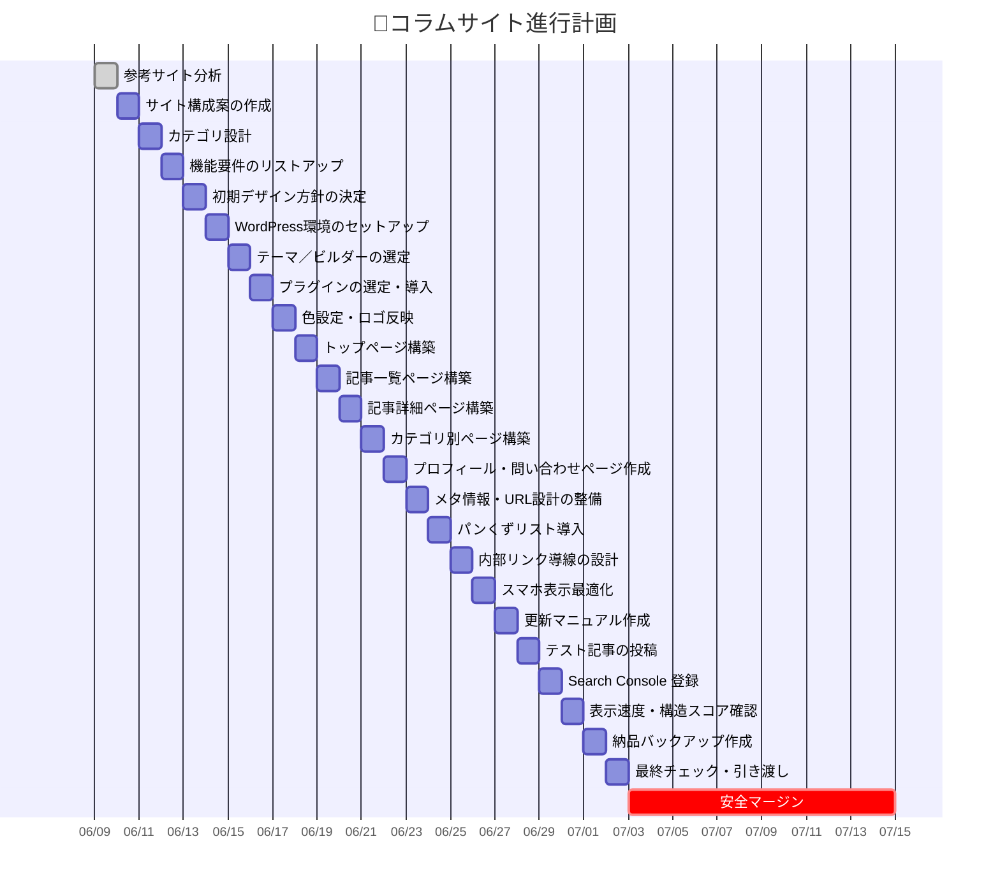

```mermaid
gantt
    title 📅コラムサイト進行計画
    dateFormat  YYYY-MM-DD
    axisFormat  %m/%d

    参考サイト分析 :done, t1, 2025-06-09, 1d
    サイト構成案の作成 :t2, after t1, 1d
    カテゴリ設計 :t3, after t2, 1d
    機能要件のリストアップ :t4, after t3, 1d
    初期デザイン方針の決定 :t5, after t4, 1d

    WordPress環境のセットアップ :t6, after t5, 1d
    テーマ／ビルダーの選定 :t7, after t6, 1d
    プラグインの選定・導入 :t8, after t7, 1d
    色設定・ロゴ反映 :t9, after t8, 1d

    トップページ構築 :t10, after t9, 1d
    記事一覧ページ構築 :t11, after t10, 1d
    記事詳細ページ構築 :t12, after t11, 1d
    カテゴリ別ページ構築 :t13, after t12, 1d
    プロフィール・問い合わせページ作成 :t14, after t13, 1d

    メタ情報・URL設計の整備 :t15, after t14, 1d
    パンくずリスト導入 :t16, after t15, 1d
    内部リンク導線の設計 :t17, after t16, 1d
    スマホ表示最適化 :t18, after t17, 1d
    更新マニュアル作成 :t19, after t18, 1d

    テスト記事の投稿 :t20, after t19, 1d
    Search Console 登録 :t21, after t20, 1d
    表示速度・構造スコア確認 :t22, after t21, 1d
    納品バックアップ作成 :t23, after t22, 1d
    最終チェック・引き渡し :t24, after t23, 1d

    安全マージン :crit, tb, after t24, 12d
```
